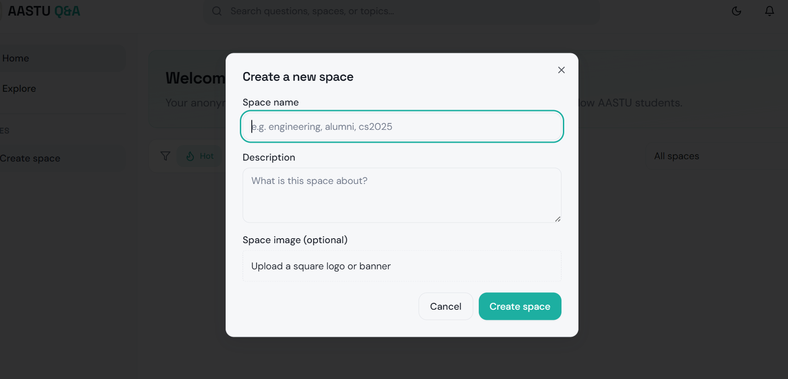
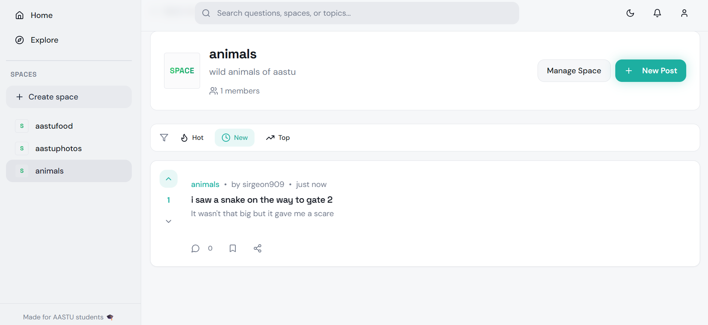
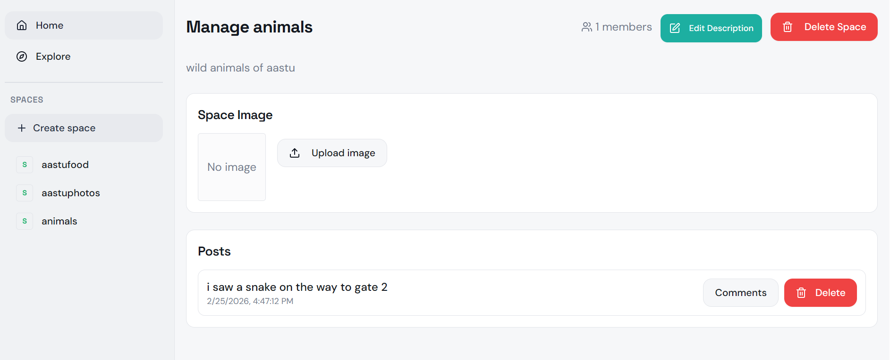
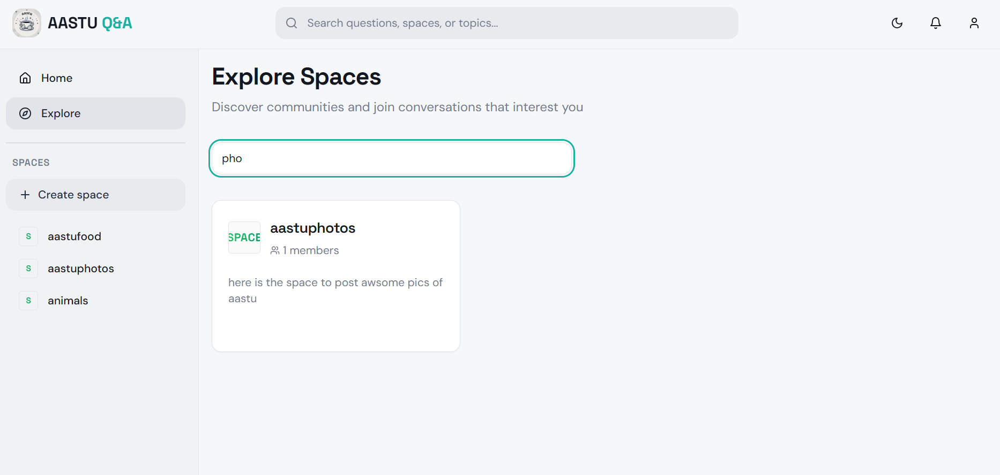
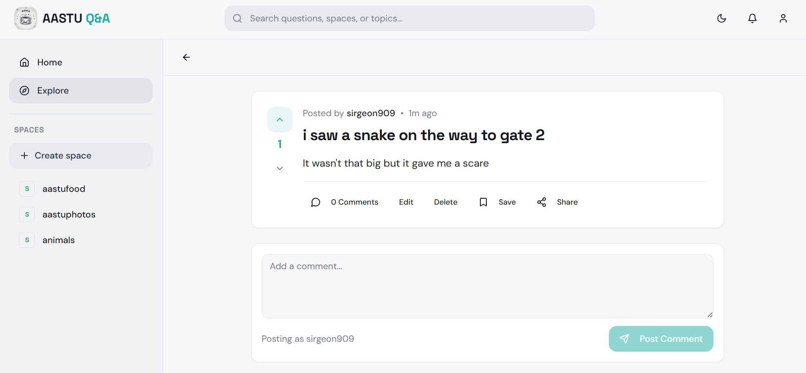
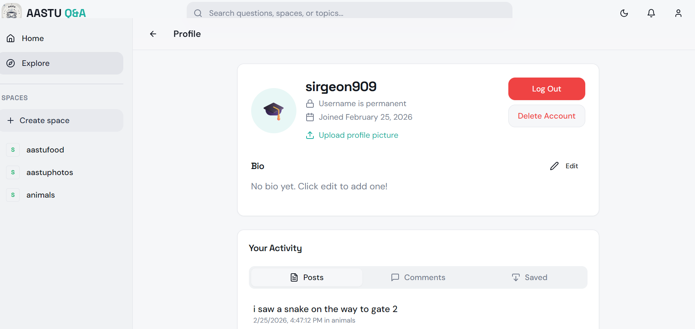
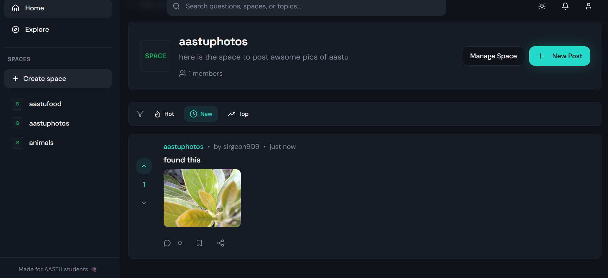
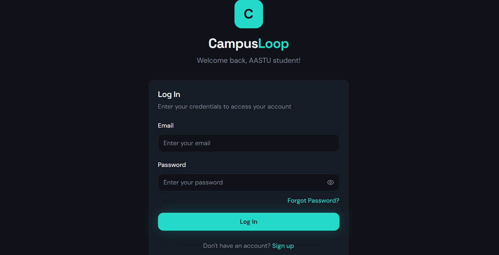

# AASTU Q&A - Frontend

The frontend application for AASTU Q&A, built with React and Vite.

## 🛠 Tech Stack

- **Build Tool**: Vite
- **Framework**: React
- **Language**: TypeScript
- **Styling**: Tailwind CSS
- **UI Components**: shadcn/ui

## 🚀 Getting Started

1. **Install Dependencies**
   ```bash
   npm install
   ```

2. **Environment Setup**
   Create a `.env` file if needed (see `.env.example` if available, or use defaults):
   ```env
   VITE_API_BASE=http://localhost:4000/api
   ```

3. **Run Development Server**
   ```bash
   npm run dev
   ```


## 📸 Screenshots

Here are some screenshots of the AASTU Q&A frontend:

<p align="center">
   
   <br/>
   
   <br/>
   
   <br/>
   
   <br/>
   
   <br/>
   
   <br/>
   
   <br/>
   
</p>

## 📜 Scripts

- `npm run dev`: Start the dev server.
- `npm run build`: Build for production.
- `npm run preview`: Preview the production build locally.
- `npm run lint`: Run ESLint.
